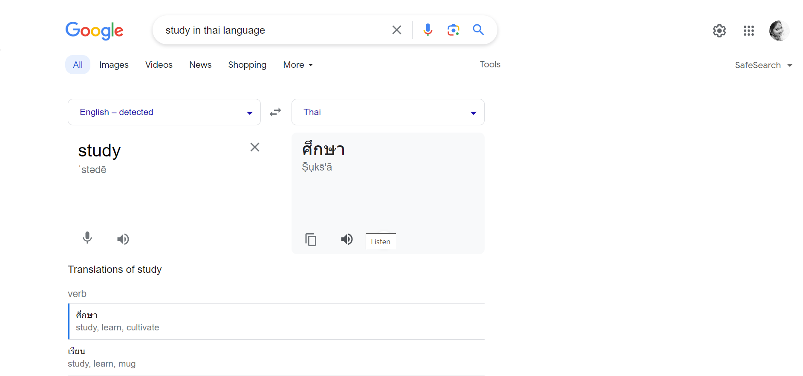
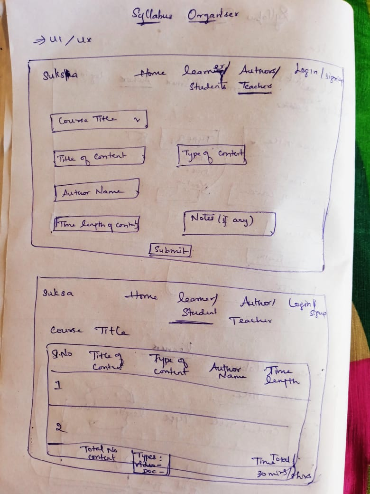

# Create Syllabus Organizer (JS-DOM Challenge)

This challenge is part of free internship (Fullstack Engineer) offered by [CyberDude Netwroks Pvt. Ltd.](https://www.cyberdudenetworks.com/). You can find all the source code and live links below.

> Task #1: creating a syllabus organizer for course

```js
import JustValidate from "just-validate";
import { v4 as uuidv4 } from "uuid";

const upload = document.querySelector("#upload-form");
const syllabus = document.querySelector("#syllabusDisplay");
const refresh = document.getElementById("go-top")

const validate = new JustValidate(upload, {
  validateBeforeSubmitting: true,
});
// console.log(validate);

const courseKey = "upload-form";

validate.addField("#courseTitle", [
  {
    rule: "required",
  },
  {
    rule: "maxLength",
    value: 30,
  },
  {
    rule: "minLength",
    value: 1,
  },
]);
validate.addField("#courseContent", [
  {
    rule: "required",
  },
  {
    rule: "minLength",
    value: 3,
  },
  {
    rule: "maxLength",
    value: 20,
  },
]);
validate.addField("#contentType", [
  {
    rule: "required",
  },
  {
    rule: "maxLength",
    value: 20,
  },
  {
    rule: "minLength",
    value: 3,
  },
]);
validate.addField("#authorName", [
  {
    rule: "required",
  },
  {
    rule: "maxLength",
    value: 20,
  },
  {
    rule: "minLength",
    value: 3,
  },
]);
validate.addField("#timeLength", [
  {
    rule: "required",
  },
]);
validate.addField("#notes", [
  {
    rule: "required",
  },
]);

validate.onSuccess(() => {
  // created a new empty array
  // formData to have key and value pair
  // get entries from that formData
  // save it in a localStorage and parse to use the data as JSON
  // If the data is once pushed and another data should add to that same array so use if..else condition

  const newArray = [];

  const formData = new FormData(upload).entries();
  // console.log(formData);

  const courseEntries = Object.fromEntries(formData);
  // console.log(courseEntries);

  const stringCourseEntries = JSON.stringify(courseEntries);
  // console.log(stringCourseEntries);

  const getDataLocalStorage = localStorage.getItem(courseKey);
  const parseData = JSON.parse(getDataLocalStorage);

  if (getDataLocalStorage) {
    parseData.push(courseEntries)
    localStorage.setItem(courseKey, JSON.stringify(parseData));
  } else {
    newArray.push(courseEntries)
    localStorage.setItem(courseKey,JSON.stringify(newArray))
  }

  getData();
  upload.reset();

});

// now get the data from the local storge
// create a table to display that data
// append to the index.html

function getData() {
  const getData = localStorage.getItem(courseKey);
  const parseGetData = JSON.parse(getData);
 
  // getting the parsed data and getting the table body
  // create a new final array to append the new tabel value
  // make sure that we have empty table content each time to append the new data

  if (parseGetData && parseGetData.length > 0) {
    syllabus.style.display = "block";

    const syllabusTableEl = document.querySelector("#syllabusTable");
    syllabusTableEl.innerHTML = " ";
    const newArrayFinal = [];

    // map function to get the data each time the course is being uploaded
    parseGetData.map((getData, index) => {
      const tr = document.createElement("tr");
      const td1 = document.createElement("td");
      const td2 = document.createElement("td");
      const td3 = document.createElement("td");
      const td4 = document.createElement("td");
      const td5 = document.createElement("td");
      const td6 = document.createElement("td");
      const td7 = document.createElement("td");
      const buttonDel = document.createElement("buttonDel");

      // console.log(getData);

      td1.classList.add("table-class")
      td1.textContent = index + 1;

      td2.classList.add("table-class");
      td2.textContent = getData.courseTitle;
      
      td3.classList.add("table-class")
      td3.textContent = getData.courseContent;

      td4.classList.add("table-class");
      td4.textContent = getData.contentType;

      td5.classList.add("table-class");
      td5.textContent = getData.authorName;

      td6.classList.add("table-class");
      td6.textContent = getData.timeLength;

      buttonDel.className = "p-2 rounded bg-[#850E35]  hover:bg-[#EE6983] hover:cursor-pointer hover:text-black text-white font-semibold font-lato text-sm";
      buttonDel.textContent = "Delete";

      buttonDel.addEventListener('click', (e) => {
        deleteData(getData);
      });
      
      td7.classList.add("table-class");
      td7.append(buttonDel)

      tr.append(td1, td2, td3, td4, td5, td6, td7)
      newArrayFinal.push(tr)
    });

    //  append each data to the table from the new array that we have stored

    newArrayFinal.forEach((el) => syllabusTableEl.append(el))
  }

}

function deleteData(course) {
  // Delet the data according to course title

  const confirmMessage = confirm(`Are you sure want to delete this ${course.courseTitle} course ?`);

  if (confirmMessage) {
    const existingCourseData = localStorage.getItem(courseKey);
    const parsedCourseData = JSON.parse(existingCourseData);

    const courseRetain = parsedCourseData.filter(deleteCourse => deleteCourse.courseTitle != course.courseTitle);

    localStorage.setItem(courseKey, JSON.stringify(courseRetain));

    getData();
  }
}

getData();

refresh.addEventListener("click", (e) => {
  window.location.href = "/";
})

```
### Live link

https://jeya-rosini.github.io/cyberdude-challenges/

## Screenshots:

-
-

## Acknowledgement:

I have to thank Mr. Anbuselvan Rocky [Mr.Anbuselvan Rocky](https://github.com/anburocky3) for the mentoring throughout this challenge

## Reference:

- [#41 - Accessing Forms and Elements](https://www.youtube.com/watch?v=8MibgZLbFRs&list=PL73Obo20O_7jhOOPDASWk0PVcRxGEyrm9&index=41)  

- [#42 - Javascript Form Submit and FormData Event](https://www.youtube.com/watch?v=RNvGJhNT2JM&list=PL73Obo20O_7jhOOPDASWk0PVcRxGEyrm9&index=42) 